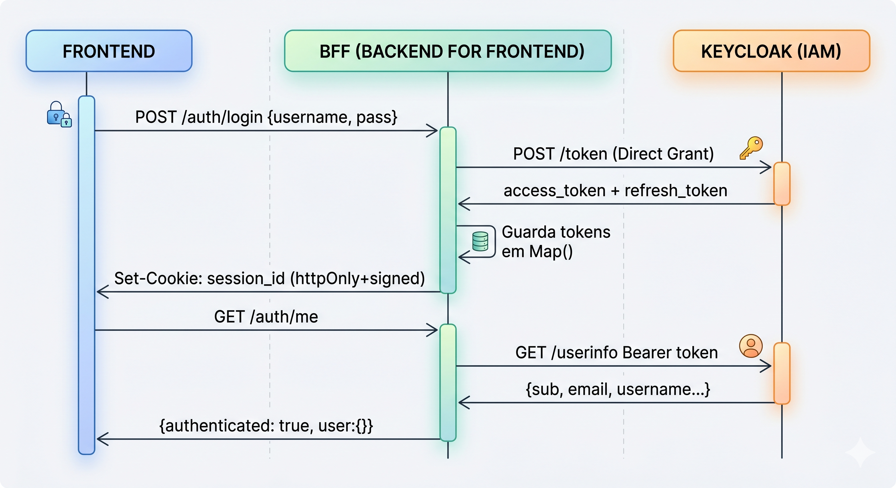
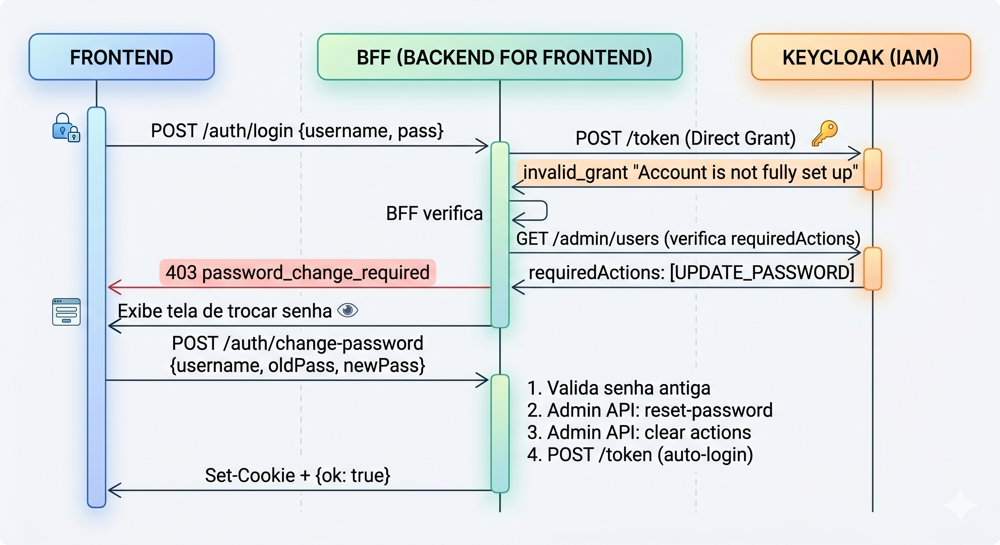
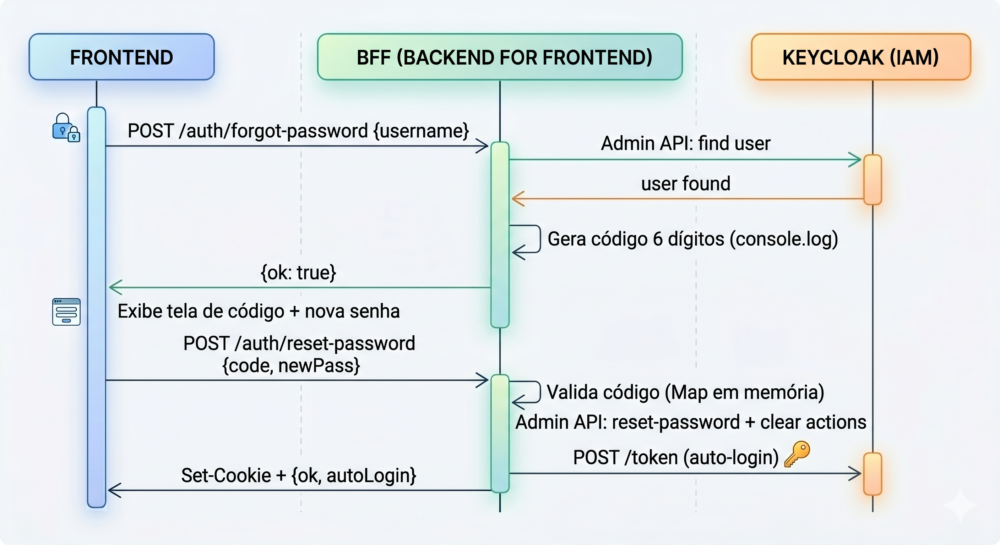
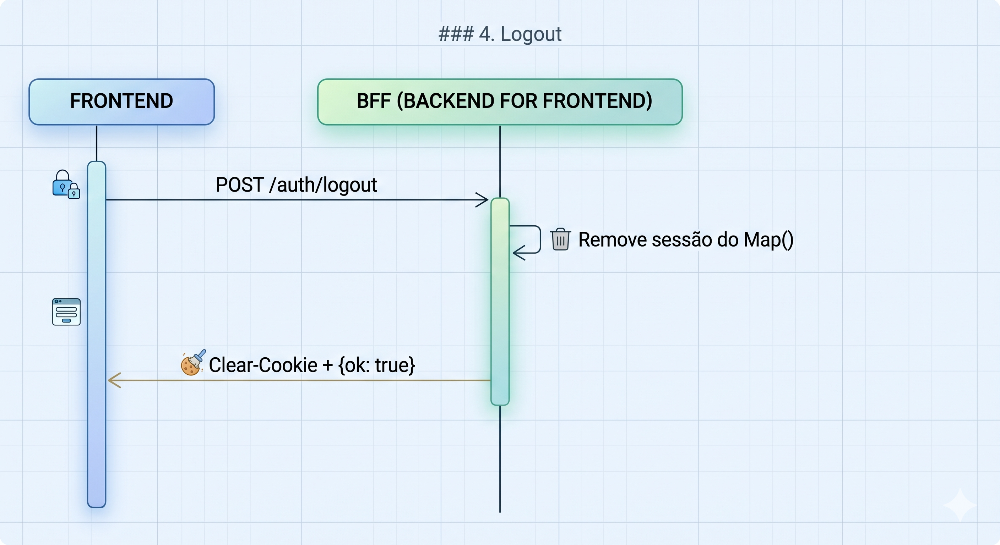

# Keycloak Login (BFF Pattern)

## Sobre

Projeto de estudo que implementa autenticação com Keycloak usando o padrão **BFF (Backend for Frontend)**. O token nunca chega ao browser — o BFF (Express) se comunica com o Keycloak, guarda os tokens no Redis e devolve apenas um cookie `session_id` httpOnly signed para o frontend (React). Inclui também notificações em tempo real via **SSE (Server-Sent Events)** com **Redis Pub/Sub** (pronto para múltiplas instâncias).

---

## Fluxos de Autenticação

### 1. Login



**Detalhes:**
- O frontend envia `username` e `password` via POST JSON
- O BFF faz um **Resource Owner Password Grant** (Direct Access Grant) no endpoint `/token` do Keycloak
- O Keycloak valida as credenciais e retorna `access_token` + `refresh_token`
- O BFF guarda os tokens no Redis indexados por um UUID (`session_id`)
- O browser recebe apenas o cookie `session_id` (httpOnly, signed, sameSite=lax)
- Para obter dados do usuário, o frontend chama `/auth/me`, que usa o `access_token` para consultar o `/userinfo` do Keycloak

### 2. Primeiro Login (Troca de Senha Obrigatória)



**Detalhes:**
- Quando o Keycloak tem `UPDATE_PASSWORD` como required action no usuário, o Direct Grant falha com `"Account is not fully set up"`
- O BFF detecta isso, consulta a Admin API para confirmar que é `UPDATE_PASSWORD`, e retorna `403 password_change_required`
- O frontend redireciona para a tela de troca de senha
- O BFF valida a senha antiga (tentando um Direct Grant), seta a nova senha via Admin API, limpa as required actions, e faz auto-login

### 3. Esqueci Minha Senha



**Detalhes:**
- O BFF busca o usuário via Admin API (não revela se o usuário existe — sempre retorna `{ok: true}`)
- Gera um código de 6 dígitos com expiração de 10 minutos e loga no console (simulando envio de email)
- O frontend envia o código + nova senha
- O BFF valida o código, reseta a senha via Admin API, e faz auto-login

### 4. Logout



---

## Segurança

| Aspecto | Implementação |
|---|---|
| Token no browser | ❌ Nunca exposto — fica só no BFF |
| Cookie | httpOnly + signed + sameSite=lax |
| Validação de sessão | Cada `/auth/me` valida o token no Keycloak |
| Senha | Validada pelo Keycloak (nunca pelo BFF) |
| Reset code | 6 dígitos, expira em 10 min (TTL Redis), uso único |
| User enumeration | `/forgot-password` sempre retorna `{ok: true}` |
| Sessões | Armazenadas no Redis com TTL de 30 min |
| SSE | Pub/Sub Redis — funciona com múltiplas instâncias |

---

## Estrutura do Projeto

```
keycloak-login/
├── docker-compose.yml          # Keycloak + Postgres
├── docker-compose.redis.yml    # Redis + Redis Insight
├── bff/
│   ├── .env                    # Variáveis de ambiente
│   ├── package.json
│   ├── tsconfig.json
│   └── src/
│       ├── index.ts            # Express + middleware + rotas
│       ├── config.ts           # Env vars + URLs do Keycloak
│       ├── redis.ts            # Instância ioredis
│       ├── keycloak.ts         # Helpers (admin token, find user, reset password)
│       ├── sessions.ts         # Sessions + reset codes via Redis
│       ├── sse.ts              # SSE clients + Redis Pub/Sub
│       └── routes/
│           ├── login.ts            # POST /auth/login
│           ├── me.ts               # GET  /auth/me
│           ├── logout.ts           # POST /auth/logout
│           ├── changePassword.ts   # POST /auth/change-password
│           ├── forgotPassword.ts   # POST /auth/forgot-password
│           ├── resetPassword.ts    # POST /auth/reset-password
│           └── notifications.ts    # GET  /auth/notifications (SSE) + POST /auth/notify
└── frontend/
    ├── package.json
    ├── vite.config.ts          # Proxy /auth → BFF
    └── src/
        ├── main.tsx            # ChakraProvider + Router + AuthProvider
        ├── App.tsx             # Rotas (PublicRoute / PrivateRoute)
        ├── hooks/
        │   ├── useAuth.tsx     # Context de autenticação
        │   └── useSSE.ts       # Hook SSE (EventSource)
        └── pages/
            ├── LoginPage.tsx
            ├── HomePage.tsx
            ├── ChangePasswordPage.tsx
            ├── ForgotPasswordPage.tsx
            └── ResetPasswordPage.tsx
```

---

## Setup

### 1. Subir o Keycloak

```bash
docker compose up -d
```

Acesse http://localhost:8080 com `admin` / `admin`.

### 2. Subir o Redis

```bash
docker compose -f docker-compose.redis.yml up -d
```

Redis Insight disponível em http://localhost:5540 (host de conexão: `redis`, porta: `6379`).

### 3. Configurar o Realm no Keycloak

1. Crie um realm chamado **myrealm**
2. Crie um client chamado **myclient**:
   - Client authentication: **ON**
   - Direct access grants: **ON**
   - Valid redirect URIs: `http://localhost:3001/*`
   - Web origins: `http://localhost:5173`
3. Copie o **Client Secret** (aba Credentials) e cole no `bff/.env` em `KEYCLOAK_CLIENT_SECRET`
4. Crie um usuário de teste no realm (aba Credentials → Set password → **desmarcar Temporary**)

### 4. Rodar o BFF

```bash
cd bff
npm install
npm run dev
```

### 5. Rodar o Frontend

```bash
cd frontend
npm install
npm run dev
```

Acesse http://localhost:5173.

---

## Endpoints do BFF

| Método | Rota | Descrição |
|---|---|---|
| POST | `/auth/login` | Login com username + password |
| GET | `/auth/me` | Retorna dados do usuário autenticado |
| POST | `/auth/logout` | Encerra sessão |
| POST | `/auth/change-password` | Troca de senha (primeiro acesso) |
| POST | `/auth/forgot-password` | Solicita código de reset |
| POST | `/auth/reset-password` | Valida código e define nova senha |
| GET | `/auth/notifications` | Stream SSE (requer sessão autenticada) |
| POST | `/auth/notify` | Envia notificação para um userId específico |

---

## SSE — Notificações em Tempo Real

O frontend conecta ao stream SSE após login. Notificações são enviadas para um userId específico.

**Testar via curl:**

```bash
curl -X POST http://localhost:3001/auth/notify \
  -H "Content-Type: application/json" \
  -d '{"userId": "SEU-USER-ID", "message": "Olá em tempo real!"}'
```

**Arquitetura (multi-instância):**

```
POST /notify (instância A)
  → Redis PUBLISH "sse:notifications"
  → Todas as instâncias recebem via SUBSCRIBE
  → Instância que tem o client daquele userId entrega via SSE
```
